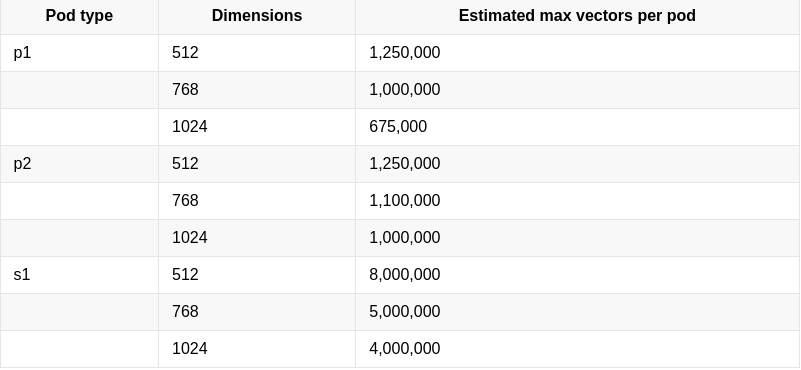

# Pinecone

- $0.0111/hour per s1 pod (aws)
- 2.5 mill vectors per s1 pod (1536 vector size)

Number of vectors produced = Number of tokens \* Vector size / Embedding size

Umsatz durch:

- 0.01$ pro upload
- Aufrunden der Zahlen auf 2. Dezimalstelle
